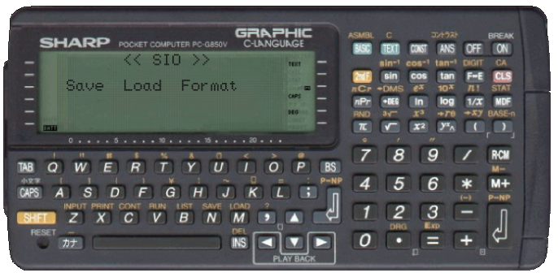

# PC-G850VS

## COM settings on the PC

## Hyperterminal Setup

File > Properties> Settings:

ASCII Button:

## Calculator Setup

[TEXT] > [S]

[F]

Select an item with [↑] [↓], set parameters with [←] [→], and confirm with [RETURN]. (Enter the end of line directly with the key)

 

## PC to Calculator

- Launch S.I.O. menu: [TEXT] > [S]

- Delete any previous text in the EDITOR area by pressing [D] key, then confirm by [Y].
- Load the ASCII file by pressing the [L] key,
- Send the file:

- Return to the S.I.O. main menu (ON/BREAK key).
- Return to the TEXT area by pressing the ON/BREAK key.
- Access to the BASIC <=> TEXT converter by pressing [B] Key.
On the calculator

