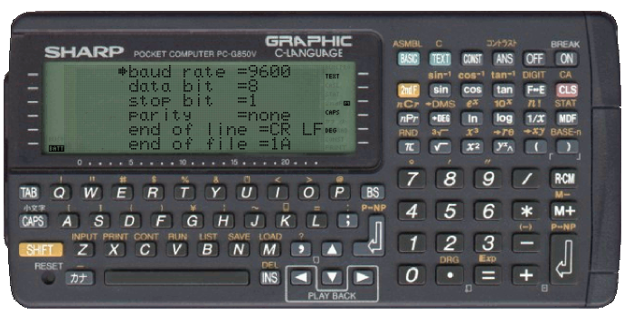

# PC-G850VS

## COM settings on the PC

## Hyperterminal Setup

- File > Properties> Settings:

- ASCII Setup:

## Calculator Setup

- [TEXT] > [S]

-[F]

- Select an item with [↑] [↓], set parameters with [←] [→], and confirm with [RETURN]. (Enter the end of line directly with the key)

 

## PC to Calculator

- Launch S.I.O. menu: [TEXT] > [S]

- Delete any previous text in the EDITOR area by pressing [D] key, then confirm by [Y].
- Load the ASCII file by pressing the [L] key,
- Send the file:

- Return to the S.I.O. main menu (ON/BREAK key).
- Return to the TEXT area by pressing the ON/BREAK key.
- Access to the BASIC <=> TEXT converter by pressing [B] Key.

## Calculator to PC

- Check EDITOR contents by pressing [E] key then the DOWN arrow :
Press [ON/BREAK] key to return to global TEXT EDITOR screen.
- Delete any previous text in the EDITOR area by pressing [D] key,
then confirm by [Y] 
- Access to the BASIC <=> TEXT converter by pressing [B] Key
- Convert BASIC program into TEXT by pressing [T] key,
then confirm by [Y]
- Access to the SERIAL Input Ouput menu by pressing [S] key :
- Send the ASCII file by pressing the [S] key
- Return to the S.I.O. main menu (ON/BREAK key).

# Where to buy a USB adapter ?

https://buyee.jp/item/yahoo/shopping/tmfg_A01-00126

# Links

- http://airbug.one.free.fr/PC-E220/PC-E220_USB.html
- http://kyoro205.blog.fc2.com/blog-entry-165.html
- https://449065.forumromanum.com/member/forum/entry_ubb.user_449065.1251138749.1111402832.1111402832.1.ram_karte_einrichten_transfile_pc_e500-sharp_pc_e500.html
- https://www.hpmuseum.org/forum/thread-10520-page-7.html
- http://kyoro205.blog.fc2.com/blog-entry-165.html
